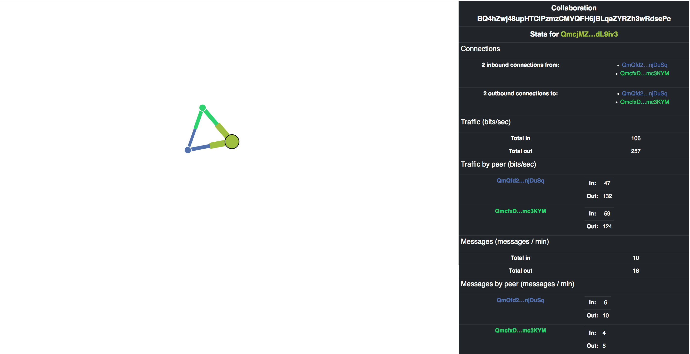

# peer-star-network-vis-react

React Component for [Peer-*](https://github.com/ipfs-shipyard/peer-star-app) collaboration network.

[](https://protocol.ai)

[](https://travis-ci.org/ipfs-shipyard/peer-star-app)



## Example

```js
import PeerStar from 'peer-star-app'
import NetworkVis from 'peer-star-network-vis-react'

dApp = PeerStar('my app')
await dApp.start()
collaboration = await dApp.collaborate('collaboration name', ...)

// inside react component.render:
<NetworkVis collaboration=collaboration />
```


## License

MIT
