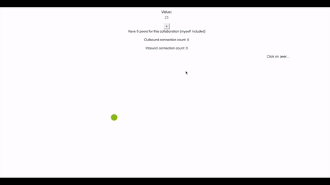

# peer-star-network-vis-react

React Component for [Peer-*](https://github.com/ipfs-shipyard/peer-star-app) collaboration network.

[](https://protocol.ai)



## Example

```js
import PeerStar from 'peer-star-app'
import NetworkVis from 'peer-star-network-vis-react'

dApp = PeerStar('my app')
await dApp.start()
collaboration = await dApp.collaborate('collaboration name', ...)

// inside react component.render:
<NetworkVis collaboration=collaboration />
```

## Styling

This component relies on some CSS classes that are defined in [the Bootstrap framework](https://getbootstrap.com).

## Modifying

If you find those class names, the layout or the markup not suitable to you, perhaps you can instead use this component as an example and use the underlying d3 network visualization canvas in [peer-star-network-vis](https://github.com/ipfs-shipyard/peer-star-network-vis).

## License

MIT
